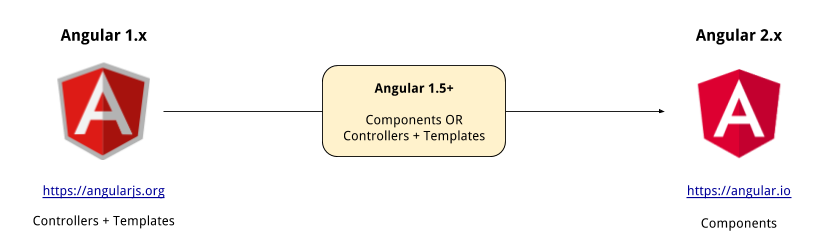

# Angular in the wild

## Objectives

By the end of this lesson you should be able to:

- List at least 4 frontend frameworks
- Describe the transition from Angular 1 to Angular 2

## A framework in flux

Ther are two major versions of Angular:

<ul>
  <li>
    <a href="https://angularjs.org/">
      
      Angular 1
    </a>
  </li>

  <li>
    <a href="https://angular.io/">
      
      Angular 2
    </a>
  </li>
</ul>

Angular 2 is a complete rewrite, and you should consider it a completely different framework.  Angular 2 is clearly the future of Angular, and makes significant improvements to Angular 1.

One of the main differences between classic Angular 1 applications and Angular 2 is the paradigm shift from controllers/templates to components.

- The majority of Angular 1 apps in the industry use controllers and templates
- All Angular 2 applications use components
- Angular 1.5+ can use either the controller/template style, or use components.

## One foot in the past, one foot in the present

This curriculum **focuses on Angular 1**, specifically Angular 1.6+.

The main documentation website is [https://angularjs.org](https://angularjs.org) (not https://angular.io).

Um... so why are we teaching you old stuff?

### Preparing you for now

Angular 1 has been in the industry since 2009, so there are a _lot_ of Angular 1 apps out there, which means that there tend to be a lot of jobs working on Angular 1 apps.  More Galvanize graduates have gone to work on teams that use Angular 1 more than any other framework (as of December 2016), and [Indeed](http://www.indeed.com/jobtrends/q-Angular-2-q-Angular.html) indicates that as of December 2016 there are roughly 3 times as many Angular 1 jobs as there are Angular 2.

### Preparing you for the future

Angular 1.5+ have support for components.  You'll soon learn that components form the basis of all modern frontend frameworks.

We've chosen Angular 1.6 because it will allow you to easily sort of "downgrade" and work on an Angular 1 application without controllers/templates, but you'll be familiar enough with component-based architectures that you will be able to transfer that knowledge to Angular 2, React, Ember etc...

### A note on reading docs online

Since Angular has been around for many years, both Angular itself and also the community standards around what idiomatic Angular is have changed.  As you read docs, you'll find a mix of Angular 1, Angular 2, controller/template examples and component examples.  In addition, you'll see differences in examples that relate to the Angular Style Guide.

- [Angular 1 Docs](https://angularjs.org) (not https://angular.io).
- [Angular 1 Style Guide](https://github.com/johnpapa/angular-styleguide/tree/master/a1)

## Popular Frontend Frameworks

Angular is one of many (dozens) of frontend frameworks that all aim to make it easy to build high-performing, rich client-side applications, often referred to as "Single Page Applications" (because the entire app runs from a single HTML page).

Here are some others:

<a href="https://angularjs.org/">
  
  Angular 1
</a>

---

<a href="https://angular.io/">
  
  Angular 2
</a>

---

<a href="">
  
  Ember
</a>

---

<a href="">
  
  React
</a>
(often used with <a href="">Redux</a> and <a href="">React Router</a>)

---

<a href="">
  
  Vue
</a>
