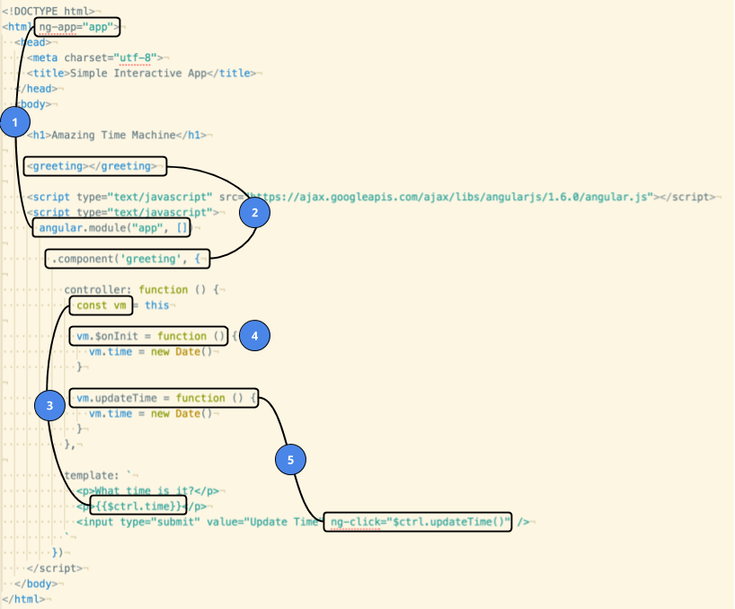

# Building a simple interactive app

Standard: **Build an Angular application (<a href="#">W0044</a>)**

## Objectives

By the end of this lesson you will be able to:

- Follow a 4-step process to create a basic interactive app
- Define and reference a Module
- Define and insert a Component
- Define a Controller and define event handlers
- Define a Template that displays Controller data and triggers events

## Why learn Components, Templates, and Controllers?

Getting a handle on the most basic aspects of interactivity in Angular 1 will be crucial to your success as an Angular developer.  Starting with a basic component / controller / template will serve as the foundation for learning every other aspect of Angular 1.

## Setup and Run

To begin, create a directory and an `index.html` file:

```
mkdir simple-interactive-app
cd !$
touch index.html
```

In order to get the best development experience, you should always run your applications in a real web server.

Make sure you have the latest version of `lite-server`

```
npm install -g lite-server
```

Run `lite-server`

> lite-server will auto-reload any changes you make, so you don't have to hit "refresh" in your browser.  If your text editor / IDE has autosave turned on, by the time you tab from your editor to your browser, it will have already refreshed 🎉

## Getting started with simple interactive app in Angular 1 (using components)

The baseline for having an interactive in Angular requires you to complete at least 4 steps:

1. Define and wire up a module
1. Define and insert a component
1. Define the component's Controller with event handlers
  - (optionally) initialize the data for the controller
1. Define the component's Template
  - Display the data from the controller
  - Trigger the event handlers

Take a look at this simple application.  Copy and paste the code into `index.html` and run [`lite-server`](https://scotch.io/bar-talk/a-fast-and-convenient-development-server-with-lite-server) to interact with it:

```html
<!DOCTYPE html>
<html ng-app="app">
  <head>
    <meta charset="utf-8">
    <title>Simple Interactive App</title>
  </head>
  <body>

    <h1>Amazing Time Machine</h1>

    <greeting></greeting>

    <script type="text/javascript" src="https://ajax.googleapis.com/ajax/libs/angularjs/1.6.0/angular.js"></script>
    <script type="text/javascript">
      angular.module("app", [])

        .component('greeting', {

          controller: function () {
            const vm = this

            vm.$onInit = function () {
              vm.time = new Date()
            }

            vm.updateTime = function () {
              vm.time = new Date()
            }
          },

          template: `
            <p>What time is it?</p>
            <p>{{$ctrl.time}}</p>
            <input type="submit" value="Update Time" ng-click="$ctrl.updateTime()" />
          `
        })
    </script>
  </body>
</html>
```

When you click the "Update Time" button, the time on the screen changes.  But what exactly is going on?

### How data flows

1. When you click "Update Time", Angular sees that you have a special attribute: `ng-click="$ctrl.updateTime()"`
1. Angular knows to look for a Controller in the same Component, and to look for a method named `updateTime`
1. The Controller's `updateTime` method gets called, which updates the `time` property on the controller
1. Angular detects that the Controller's data has change, and re-renders the Template!

It can seem like 🎩 magic 🐰, in part because Angular does a lot of work for you.  But in order for Angular to do the work, you need to make sure that things are "wired up" correctly.  In the next section, you'll learn what all those touch points are.

### Anatomy of the application



**#1 Modules**

Every Angular 1 application needs a top-level module.  Convention is to name it "app".

You _define_ a module like so:

```
angular.module("app", [])
```

You _connect_ (or "wire up") the module to the page like so:

```html
<html ng-app="app">
```

> RULE: The name of the `ng-app` attribute _must_ match the first argument of `angular.module`.

**#2 Components**

Think of a Component as being a custom HTML tag that you get to define.

You _define_ a Component like so:

```js
angular.module("app", [])
  .component('someName', {
    controller: function(){},
    template: "..."
  })
```

The first argument, "someName", is the _name_ of the component.  The second argument is an object that defines the component's behavior.

You _insert_ a component by writing it out as an HTML tag, like so:

```html
<some-name></some-name>
```

> RULE: When you _define_ a component, use camelCase.  When you display a component, use the lowercase-dasherized name

**#3 Defining and Referencing Controllers / Templates**

Controllers and Templates go hand-in-hand.

Each component has a controller.  This is similar to route handlers in Express.  Your controller is where you do things like define click-handlers and setup the data that your template needs.

You _define_ a controller by setting the `controller` property of the component:

```js
.component('greeting', {
  controller: function () {
    const vm = this
    // code goes here
  },
})
```

Templates are where you put all of your HTML, with special Angular 1 instructions (such as interpolation with `{{expression}}`).

You define a template like so:

```js
.component('greeting', {
  template: `
    <p>What time is it?</p>
    <p>{{$ctrl.time}}</p>
  `
})
```

From within the controller, you _reference_ the controller object with `vm`.

From within a Template, you _reference_ the controller with `$ctrl`.

> RULE: You should always put `const vm = this` as the first line of the controller.

**#4 Defining load-time behavior with `$onInit`**

Anything you'd like to do when the controller is loaded should be placed in the `$onInit` function.

You _define_ `$onInit` like so:

```js
controller: function () {
  const vm = this

  vm.$onInit = function () {
    vm.time = new Date()
  }
}
```

However, you never _call_ `$onInit` - Angular calls it at the appropriate time.

**#5 Defining Event Handlers and Triggering Events**

In order for your application to be interactive, you must be able to handle events.

You _define_ event listeners in the controller, like so:

```js
controller: function () {
  const vm = this

  vm.updateTime = function () {
    vm.time = new Date()
  }
},
```

You _trigger_ events in the Template with special `ng-<event>` attributes, like so:

```js
.component('greeting', {
  template: `
    <input type="submit" value="Update Time" ng-click="$ctrl.updateTime()" />
  `
})
```

## Exercise

Recall that the basic steps to creating a dynamic app are:

1. Define and wire up a module
1. Define and insert a component
1. Define the component's Controller with event handlers
  - (optionally) initialize the data for the controller
1. Define the component's Template
  - Display the data from the controller
  - Trigger the event handlers

Also recall that you always want to run your app with a real server such as `lite-server`.

### !challenge
* type: project
* id: angular-curriculum-drills-simple-interaction
* title: Simple Interaction

##### !question
## Build a Simple Interactive App

- Follow [the instructions](./02 - Unit Overview.md) to update angular-drills, for example:

  ```
  git checkout master
  git fetch upstream
  git rebase upstream/master
  git checkout -b simple-interaction
  git push -u origin simple-interaction
  ```
- Complete the [simple-interaction](https://github.com/gSchool/angular-drills/tree/master/simple-interaction) challenge

It comes with tests so you can see if you finished it correctly.  Make sure tests pass before submitting!

Submit the URL to your solution below.
##### !end-question

##### !placeholder
https://github.com/<your name>/angular-drills/tree/simple-interaction/simple-interaction
##### !end-placeholder

##### !explanation
See the solutions folder (if you haven't already)
##### !end-explanation
### !end-challenge


## Questions

Consider the following application:

```html
<!DOCTYPE html>
<html ng-app="app">
  <head>
    <meta charset="utf-8">
    <title>Simple Interactive App</title>
  </head>
  <body>
    <h1>Amazing Time Machine</h1>
    <app></app>
    <script type="text/javascript" src="https://ajax.googleapis.com/ajax/libs/angularjs/1.6.0/angular.js"></script>
    <script type="text/javascript">
      angular.module("app", [])
        .component('app', {
          controller: function () {
            const vm = this
            vm.$onInit = function () {
              vm.app = "app"
            }
          },
          template: `
            <p>What's the app?</p>
            <p>{{$ctrl.app}}</p>
          `
        })
    </script>
  </body>
</html>
```

The following 3 questions relate to the application above.

### !challenge
* type: multiple-choice
* id: wdi-angular-match-components-01
* title: Match Component #1

##### !question
If you changed `.component('app', {` to `.component('windsor', {`, which other line would have to change?
##### !end-question

##### !options
- Nothing - it would work perfectly
- `<app></app>`
- `angular.module("app", [])`
- `.component('app', {`
- `vm.app = "app"`
- `<p>{{$ctrl.app}}</p>`
##### !end-options

##### !answer
`<app></app>`
##### !end-answer

##### !explanation
`.component('app', {` defines a component, and `<app></app>` references that component.

So if you change the component name to windsor, you need to change `<app></app>` to `<windsor></windsor>`
##### !end-explanation
### !end-challenge

### !challenge
* type: multiple-choice
* id: wdi-angular-match-components-02
* title: Match Component #2

##### !question
If you changed `ng-app="app"` to `ng-app="fraggle"`, which other line would have to change?
##### !end-question

##### !options
- Nothing - it would work perfectly
- `<app></app>`
- `angular.module("app", [])`
- `.component('app', {`
- `vm.app = "app"`
- `<p>{{$ctrl.app}}</p>`
##### !end-options

##### !answer
`angular.module("app", [])`
##### !end-answer

##### !explanation
You declare a module with `angular.module("app", [])` and reference it with `ng-app="app"`.

So if you change to `ng-app="fraggle"` you must also change to `angular.module("fraggle", [])`
##### !end-explanation
### !end-challenge

### !challenge
* type: multiple-choice
* id: wdi-angular-match-components-03
* title: Match Component #3

##### !question
If you changed `vm.app = "app"` to `vm.glee = "app"`, which other line would have to change?
##### !end-question

##### !options
- Nothing - it would work perfectly
- `<app></app>`
- `angular.module("app", [])`
- `.component('app', {`
- `vm.app = "app"`
- `<p>{{$ctrl.app}}</p>`
##### !end-options

##### !answer
`<p>{{$ctrl.app}}</p>`
##### !end-answer

##### !explanation
Properties set on the controller (in this case `this` or `vm`) need to match the expressions in the template.

So if you change to `vm.app = "app"` to `vm.glee = "app"` you also need to change `<p>{{$ctrl.app}}</p>` to `<p>{{$ctrl.glee}}</p>`
##### !end-explanation
### !end-challenge
