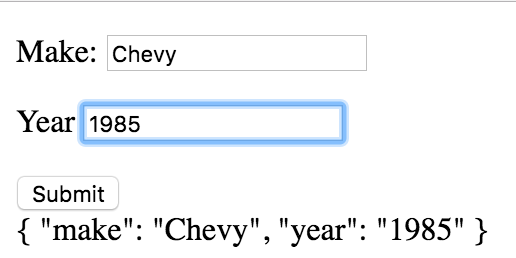

# Bind Forms to Objects

Standard: **Build an Angular application (<a href="#">W0044</a>)**

## Objectives

By the end of this lesson you will:

- Bind multiple form controls to the same object
- Use ng-submit to trigger controller actions
- Clear a form (<-- it's soooo easy)

## Rationale

One of the most basic and common things you'll do in an interactive single-page application is to:

- Collect data from a form
- Process and/or display that data (often in a list)
- Clear the form

This happens quite differently in Angular 1 than it would happen if you were writing raw DOM manipulation code.

## Conceptually mapping forms to objects

In most cases when you program a form, all of the fields of that form map nicely to an object.  For example if you are representing a song, your form might look like:

```html
<form>
  <input name="title"/>
  <input name="duration"/>
  <input name="artist"/>
</form>
```

And that would map to an object like:

```js
let song = {
  title: 'Dear Theodosia',
  duration: '3:04',
  artist: 'Lin Manuel Miranda, Leslie Odom Jr.',
}
```

Angular 1 provides an easy, declarative way to make this happen.

## Sample Code

```js
angular.module('app', [])
  .component('app', {
    template: `
      <form>
        <input type="text" ng-model="$ctrl.car.make" />
        <input type="text" ng-model="$ctrl.car.year" />
        <input type="submit">
      </form>

      {{$ctrl.car | json}}
    `
  })
```

If you open angular-examples/bind-form-to-object you'll see that as you type, Angular maps each form field to a property in the object:



## Sequence of events

Angular 1 makes it incredibly easy to build nested objects, so you can nest as deeply as you'd like.  Here's the sequence of events:

1. The Angular app boots
1. The user starts to type into one of the fields
1. Angular sees that you declared `ng-model="$ctrl.car.year"`
1. Angular looks for a `.car` property on the controller, and doesn't find it, so it creates an empty object
1. Angular sets the `.year` property on the `car` in the controller
1. The result is that in the controller, there is an object like `{year: 1985}`

## Handling form submissions

In most normal cases you will need to respond to a user submitting the form, which you do with `ng-submit` like so:

```js
angular.module('app', [])
  .component('app', {
    controller: function appController() {
      const vm = this

      vm.createCar = function createCar() {
        // if the user typed "Ford", 1999 then `vm.car` would be {make: "Ford", year: 1999} here
        console.log(vm.car)
      }
    },

    template: `
      <form ng-submit="$ctrl.createCar()">
        <input type="text" ng-model="$ctrl.car.make" />
        <input type="text" ng-model="$ctrl.car.year" />
        <input type="submit">
      </form>

      {{$ctrl.car | json}}
    `
  })
```

This is very similar to the way you captured a button click with `ng-click` earlier.  One thing to note is that you _must_ have a submit button for the form to work in Angular.

## Clearing the form

Think through this for a moment:

- When you write an input like `ng-model="$ctrl.car.make"` it's bound to the `make` property of the `car` object
- When a user clicks the button, the controller handles the event

So what's the simplest thing you can do to clear the form?

Just set it to an empty object!  Or null, or delete it entirely.

```js
controller: function appController() {
  const vm = this

  vm.createCar = function createCar() {
    // this will entirely reset the form
    delete vm.car
  }
},
```

## A note on data binding

Notice how in the `createCar` method, you didn't _pass_ a car into it.  Instead, `vm.car` was just "magically" available.  When you build server side apps, you have to _pass_ the form data from the client to the server (via an HTTP request), but since all of this is running in the browser, the controller is _stateful_.  That is, both the controller and template have access to all of the properties on the controller.

Since `ng-model` binds the form control to a property, every time they type the underlying object is updated.  So by the time the `ng-submit` is triggered, the bound object is already fully inflated, and you have direct access to it.

## Bonus: Setting default values

Let's say you want to set some default values, and when you reset the form you want to reset to default values as well.  You can accomplish that with a combination of `$onInit` and some simple javascript functions:

```js
function controller() {
  const vm = this

  vm.$onInit = onInit
  vm.createCar = createCar

  function $onInit() {
    setCar()
  }

  function createCar() {
    setCar()
  }

  function setCar() {
    vm.car = {make: 'Toyota'}
  }
}
```

Now when the form loads the first time, `Toyota` will be pre-filled-in, and when you submit the form and reset it, it will be restored as the default.

## Form Anti-Patterns

An anti pattern is a way of writing code that is a bad practice in your framework.  There are a few things you should **not** do with `ng-submit`.

1. Do not use `ng-submit` on the form and `ng-click` on the submit button at the same time. Use either ng-submit on the form and no directive on the submit button, or use `ng-click` on the submit button and no directive on the form. `ng-submit` is preferred in a form.
2. Do not create separate properties directly on the controller object for each form field. Instead, create an object that contains all the form properties inside of it. In the above example, `$ctrl.car` is the object that will contain each form property.
3. Never do any DOM manipulation in your controller. When submitting form data, it is often tempting to revert back to the jQuery way of doing things. For example, do not attempt to append the new form data to the DOM inside of your controller. In fact, **do not do any DOM manipulation in the controller**. Instead, add the data that you want to display to an object in the scope that will then be displayed in the view.

## Questions

### !challenge

* type: multiple-choice
* id: angular-curriculum-bind-forms-01
* title: Object Shape #1

##### !question
Given the following form, how would you access the `height` that the user enter?

```html
<form>
  <input type="text" name="tableWidth" ng-model="$ctrl.width" />
  <input type="text" name="tableHeight" ng-model="$ctrl.height" />
  <input type="text" name="tableDepth" ng-model="$ctrl.depth" />
</form>
```
##### !end-question

##### !options
- `vm.tableHeight`
- `vm.height`
- `vm.$ctrl.height`
- `tableHeight.height`
- None of the above
##### !end-options

##### !answer
`vm.height`
##### !end-answer

##### !explanation
Since these fields bind directly to properties on the controller (an anti-pattern), the controller can just use `vm.height`
##### !end-explanation
### !end-challenge

### !challenge

* type: short-answer
* id: angular-curriculum-bind-forms-02
* title: Object Shape #2

##### !question
What `ng-model` code would you write in order to create an object of this shape?

```js
{
  person: {
    address: {
      state: {
        name: ""
      }
    }
  }
}
```
##### !end-question


##### !placeholder
ng-model="$ctrl.??"
##### !end-placeholder

##### !answer
ng-model="$ctrl.person.address.state.name"
##### !end-answer

##### !explanation
When Angular sees multiple chained properties, it constructs the appropriate object.
##### !end-explanation
### !end-challenge
