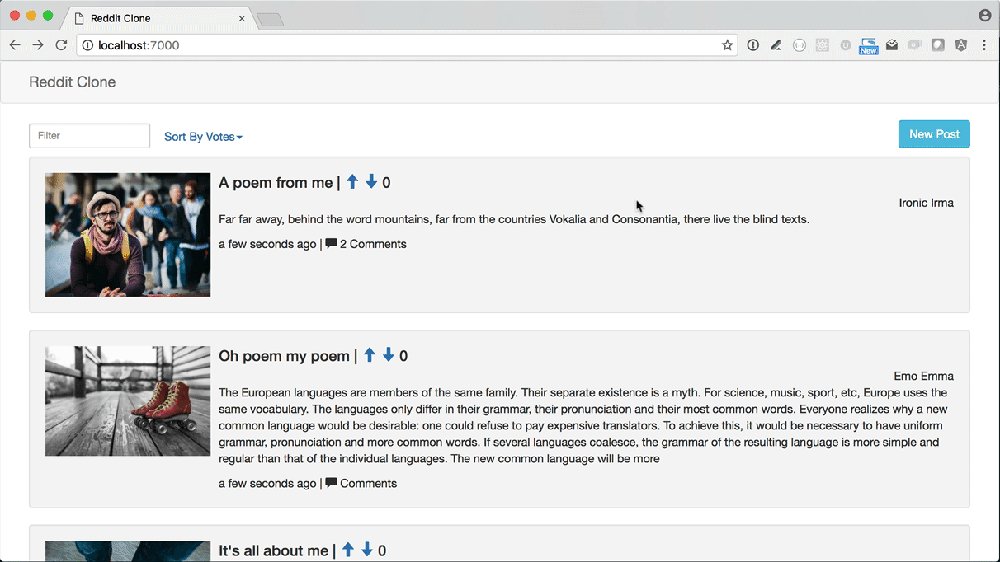
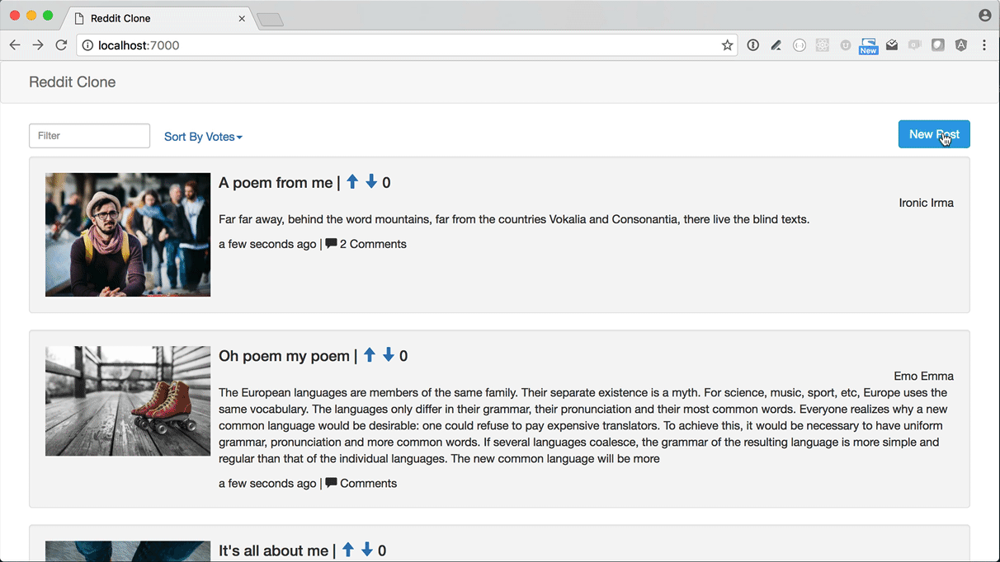
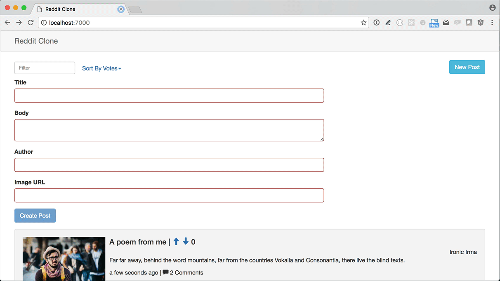
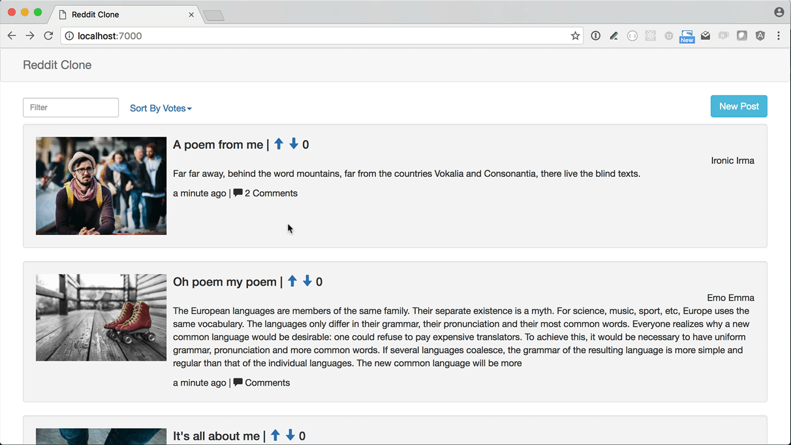
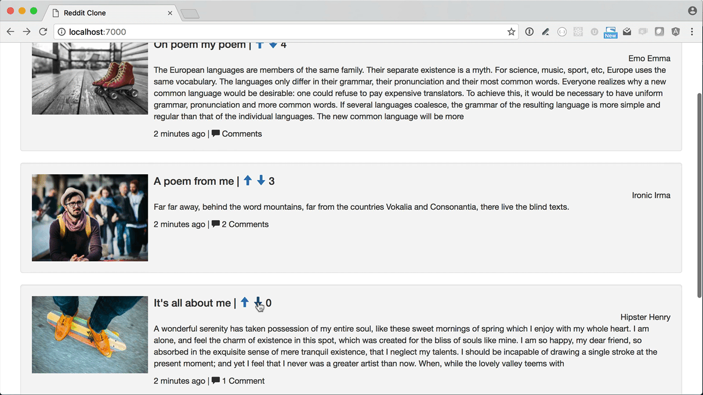
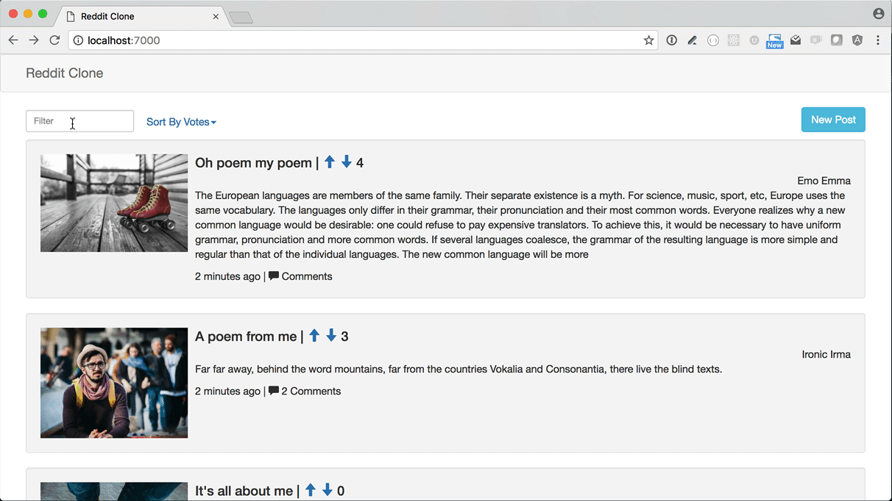
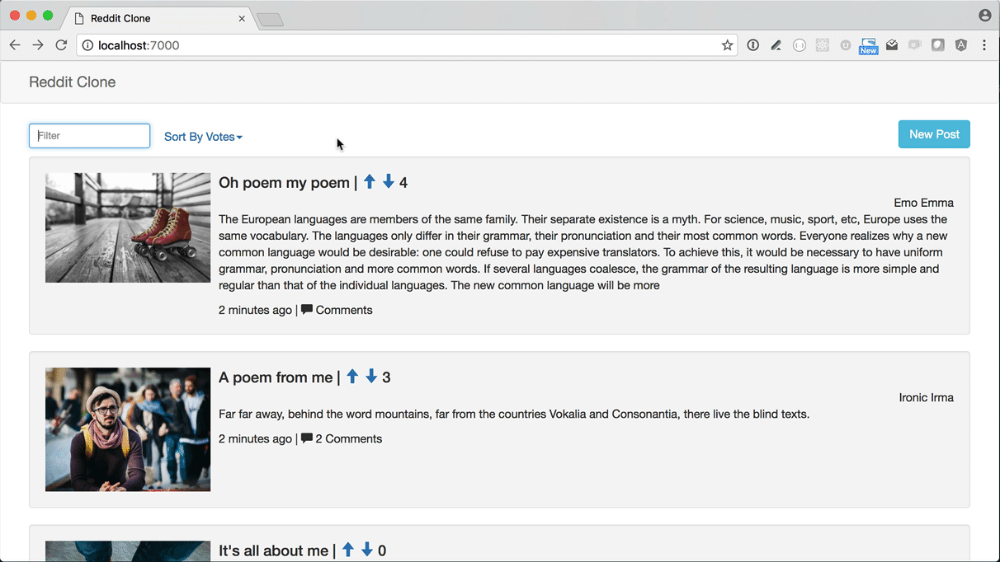
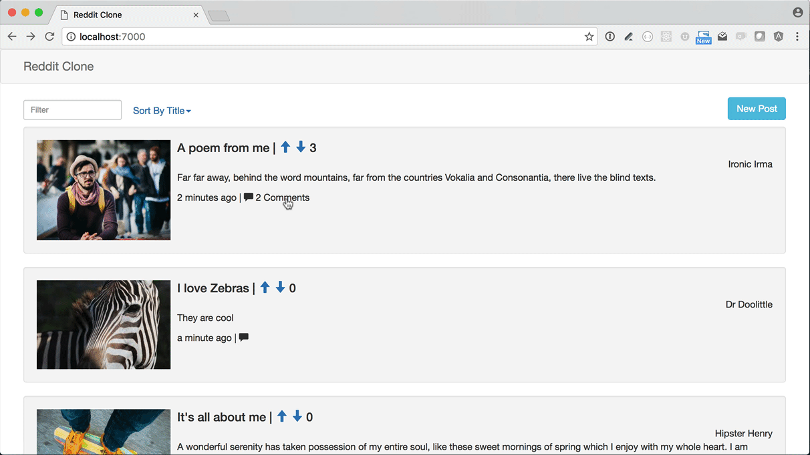

# Assessment: Angular Reddit Clone

Standard: **Build an Angular application (<a href="#">W0044</a>)**

Your assessment will be considered successful when:

- Uses builtin directives and filters (ng-repeat, ng-class, ng-if etc...)
- Uses data-binding (that is, doesn't use direct DOM manipulation)
- Routes directly to components
- Uses the following patterns from the Angular 1 Styleguide:
  - [iifes](https://github.com/johnpapa/angular-styleguide/tree/master/a1#iife)
  - [Named Functions](https://github.com/johnpapa/angular-styleguide/tree/master/a1#named-vs-anonymous-functions)
  - [ControllerAs](https://github.com/johnpapa/angular-styleguide/tree/master/a1#controllers)
  - [Bindable Members Up Top](https://github.com/johnpapa/angular-styleguide/tree/master/a1#bindable-members-up-top)
  - [Naming Guidelines](https://github.com/johnpapa/angular-styleguide/tree/master/a1#naming)
  - [Controller Names](https://github.com/johnpapa/angular-styleguide/tree/master/a1#controller-names)
  - [Folders-By-Feature Structure](https://github.com/johnpapa/angular-styleguide/tree/master/a1#folders-by-feature-structure)

---

## Angular Guidelines

- All post data should only be stored in memory
  - That is, a page refresh will clear all added posts, and that's OK
- You do _not_ have to make any ajax requests or actually contact the reddit API

## User Stories

Feel free to Style / theme / rename the app to make it something you might put on your portfolio.

**Users can create a post**

- Users can toggle the "New Post" form
- Users can create posts
  - Each post has a title, author, image, and description
- Users cannot create a new post if any of the inputs are blank
  - Fields should only appear invalid once they've tabbed off
- Users cannot click "Create Post" until the form is valid

**Users can view posts**

- Users see the number of comments correctly pluralized
  - i.e. "0 comments" or "1 comment"
- Users see posts dynamically reorder according to number of votes
- Users see the post's date/time displayed nicely
  - i.e. "Yesterday at 3:09pm", "4 minute ago", etc.
  - You will need an [external library](https://github.com/urish/angular-moment)

**Votes**

- Users can upvote
- Users can downvote
  - But not make it go lower than 0

**Filter**

- Users can filter based on the post title

**Sort**

- Users see posts ordered by votes (most first) by default
- Users can sort by Date or by Title

**Comments**

- Users can toggle comments
- Users can add comments

## Detailed Wireframes

**Posts**

Form toggle



Validations



Creating and viewing a post



**Votes**

Upvoting



Downvoting



**Filter**



**Sort**



**Comments**




### !challenge
* type: project
* id: angular-curriculum-assessment-1-reddit-clone-github-url
* title: Reddit Clone Part 1

##### !question
### Submit Your Solution
Submit the URL to your Reddit Clone repository on GitHub

- Follow [the instructions](../10 - Building Apps/02 - Unit Overview.md) to update angular-drills, for example:

  ```
  git checkout master
  git fetch upstream
  git rebase upstream/master
  git checkout -b reddit-clone-part-1
  git push -u origin reddit-clone-part-1
  ```
- Complete the [reddit-clone-part-1](https://github.com/gSchool/angular-drills/tree/master/reddit-clone-part-1) challenge

It comes with tests so you can see if you finished it correctly.  Make sure tests pass before submitting!

Submit the URL to your solution below.
##### !end-question

##### !placeholder
Submit your github link
##### !end-placeholder

##### !explanation
An instructor will review and score this.
##### !end-explanation
### !end-challenge


## Bonus Features

- Animate posts as they are added and removed from the search results
  - http://plnkr.co/edit/qrQwv1?p=preview
  - https://divshot.com/blog/tips-and-tricks/angular-1-2-and-animate-css/
  - http://odetocode.com/blogs/scott/archive/2014/02/25/easy-animations-for-angularjs-with-animate-css.aspx
- A user can choose to sort ascending or descending
- A user can favorite posts and view all favorites in a separate tab
