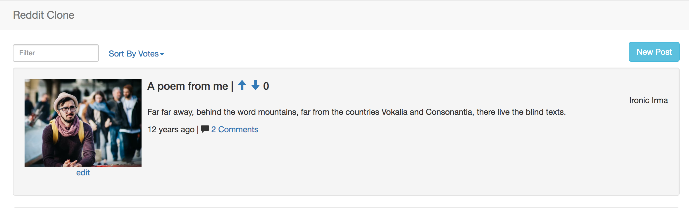
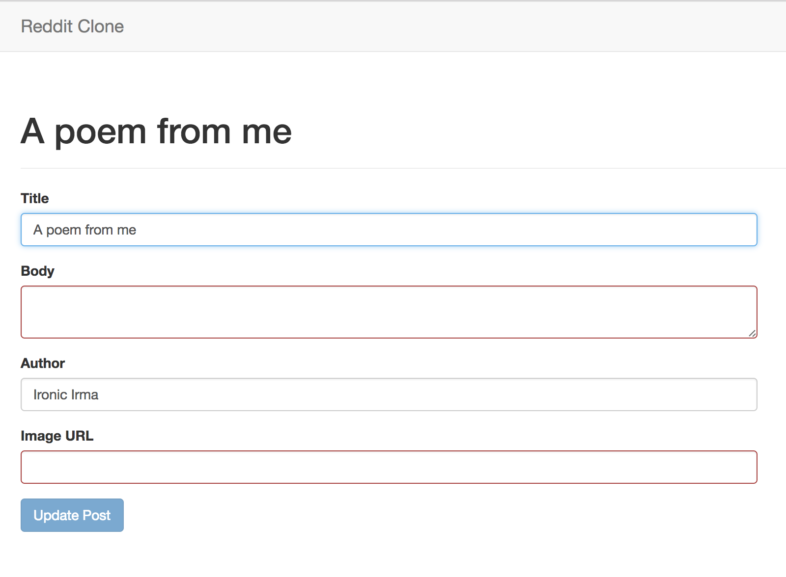

# Angular API Integration Assessment

The lessons in this section all relate to the the following standard:

> Build an Angular CRUD application against an HTTP API (W0045)

In order to demonstrate that you've mastered the core concepts, you will be asked to build an app where:

- App has routes with dynamic path segments, configured with clean urls (html5Mode)
- Uses $http and promises well
- App loads data from the server on page load (index page)
- Allows users to create records that appear on the screen without refreshing, and appear the same when refreshing (new records must get the id)
- Allows users to update records that update on the screen without refreshing, and appear the same when refreshing
- Allows users to remove records that disappear from the screen without refreshing, and don't reappear when refreshing
- Deep links should load data the same way as clicking from the index page
- Follows the Angular Style Guide, specifically:
  - [Services](https://github.com/johnpapa/angular-styleguide/blob/master/a1/README.md#services)
  - [Manual Injection Annotation](https://github.com/johnpapa/angular-styleguide/blob/master/a1/README.md#manual-annotating-for-dependency-injection)
  - [Continues the Folder-by-Feature Structure](https://github.com/johnpapa/angular-styleguide/blob/master/a1/README.md#folders-by-feature-structure)
- Could be ngResource or $http

## Features

Take your existing Reddit clone and persist everything to the database, specifically:

- Loading posts and comments from the server
- Adding posts
- Voting (up or down)
- Adding comments

Also add the additional feature that users can edit a post.  

- When a user views the homepage
- Then every post should have an "edit" link
- And when they click the "edit" link
- They should be on `/posts/:id/edit`
- And they should see a post form identical to the one on the homepage
  - Except the button should say "Update Post"
  - All the same validation rules apply
- And when they click "Update Post"
- Then they should be redirected to the homepage

**Designs**

Edit link:



Edit form:



### !challenge
* type: project
* id: angular-curriculum-assessment-2-reddit-clone-github-url
* title: Reddit Clone Part 2

##### !question
### Submit Your Solution
Submit the URL to your Reddit Clone repository on GitHub

- Follow [the instructions](../10 - Building Apps/02 - Unit Overview.md) to update angular-drills, for example:

  ```
  git checkout master
  git fetch upstream
  git rebase upstream/master
  git checkout -b reddit-clone-part-2
  git push -u origin reddit-clone-part-2
  ```
- Complete the [reddit-clone-part-2](https://github.com/gSchool/angular-drills/tree/master/reddit-clone-part-2) challenge

It comes with tests so you can see if you finished it correctly.  Make sure tests pass before submitting!

Submit the URL to your solution below.
##### !end-question

##### !placeholder
Submit your github link
##### !end-placeholder

##### !explanation
An instructor will review and score this.
##### !end-explanation
### !end-challenge
