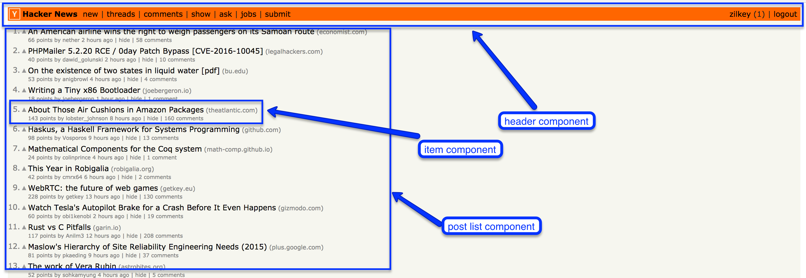
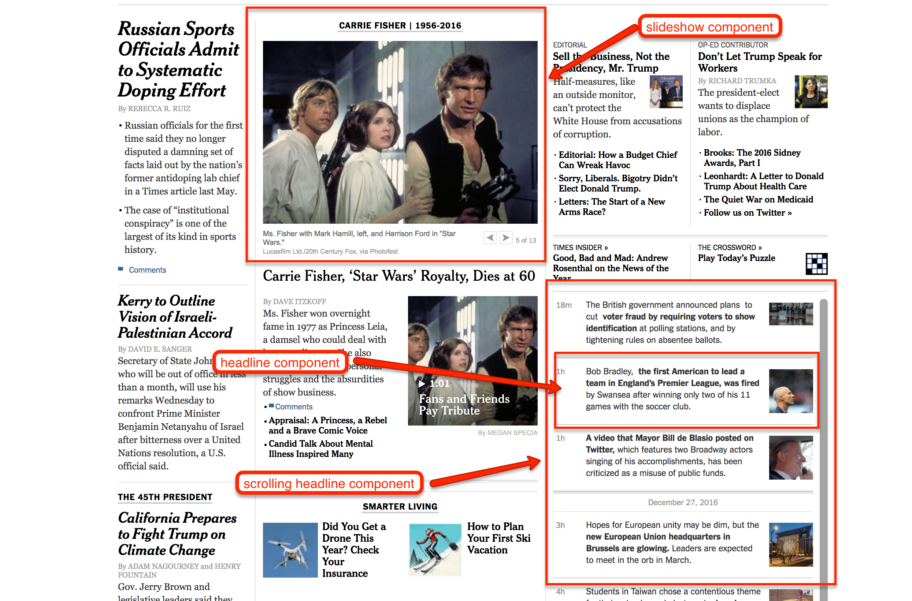

# Identifying Components

Standard: **Refactor Angular applications to use services and components (<a href="#">W0046</a>)**

## Objectives

By the end of this lesson you will:

- Come up with reasonable guesses as the the optimal component structure of a page

## Rationale

In every web framework that you use you'll have to decide how to break your code up into logical components.

If your components are too big, then each source file will be harder to read / maintain, and it'll be harder to reuse code across your application.

However, if you get _too_ granular, then your code will be hard to maintain since you'll have deep component trees and it can be hard to debug.

## Deciding how to break up components

First off, there's an easy rule:

**Guidline #1: There's always a top-level components**.  Typically this is called `App` or something similar.  

Whether the headers/footers/sidebars are part of the top-level component really depends on how complex they are.

**Guideline #2: Lists are generally 2 components, a list component, and an item component**.  So if you are building reddit, you might have this:

**Guideline #3: "Widgets" generally get their own component**.  Widget-ey things are:

- Paginated lists
- Never-ending scrolling lists
- Slideshows
- Sections that expand/collapse

You can see a few of these types of things on the nytimes website:

There's a whole art to figuring out the component boundaries, but these three guidelines should get you started.
