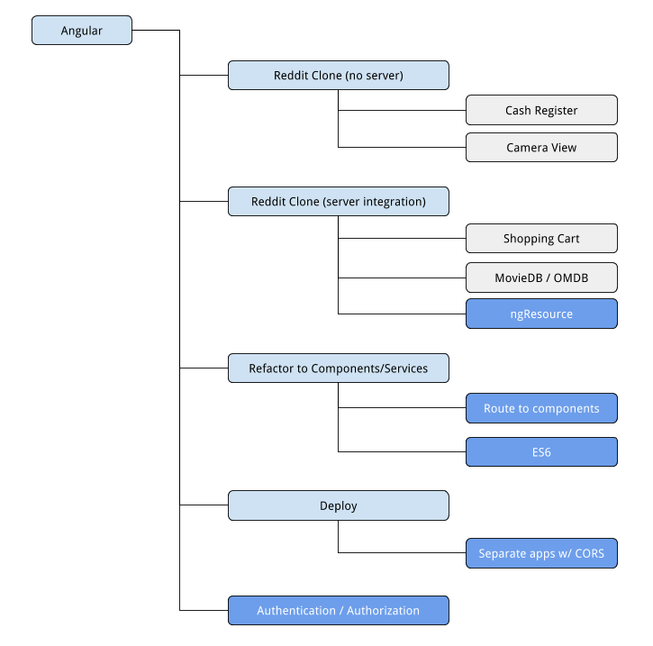

# Angular Curriculum

## Welcome!

By the end of this curriculum you should be able to:

- Build an Angular application with routes (W0044)
- Build an Angular CRUD application against an HTTP API (W0045)
- Refactor Angular applications to use services and components (W0046)
- Deploy a fullstack single-page application (W0047)

If you master the above standards and still have time, you may also elect to:

- Implement token-based authentication (W0049)
- Deploy separate client-server applications with CORS (W0051)

There are 4 project-based assessments that you'll be asked to deliver:

- [Reddit Clone (without a database)](10 - Building Apps/19 - Assessment: Reddit Clone.md)
- Connecting your Reddit Clone to a database
- Deploying your database-backed Reddit Clone and submitting the URL
- Refactoring your Reddit Clone to use components and services

## Instructors

- [Original map image](https://docs.google.com/drawings/d/1OhVKtxOmoyTJbrxB00AaBa-l7X_jMCxQQpC4FQuWj6U/edit)
